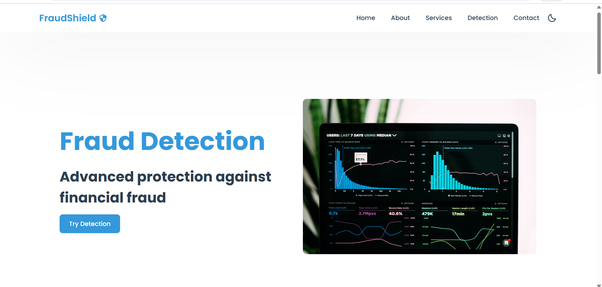
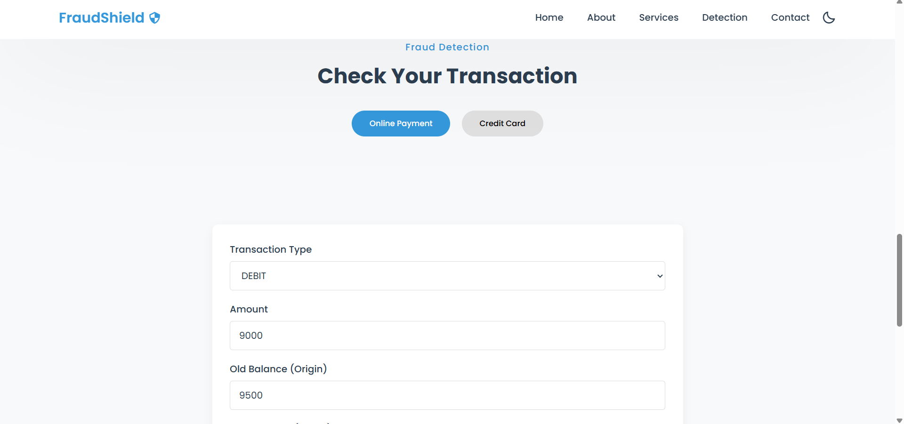

# 🛡️ FraudShield - Financial Fraud Detection System

This repository contains the **FraudShield** project. It is a web application that predicts the likelihood of fraud in **Credit Card Transactions** and **Online Payments** using pre-trained **Random Forest** machine learning models. The app is built with **Flask** for the backend and a beautiful, responsive frontend.

---

## Features

1. **Fraud Detection Predictions**:  
   - Credit Card Fraud Detection  
   - Online Payment Fraud Detection  

2. **Flask Web Application**:  
   - Interactive and responsive user interface for predictions.  
   - Real-time prediction and feedback on transactions.

3. **Pre-trained Machine Learning Models**:  
   - Random Forest models are trained and saved for instant prediction during runtime.

4. **Dark Mode Support**:  
   - Users can toggle between light and dark themes for better experience.

---

## Datasets

The models were trained on publicly available fraud detection datasets:  
- Credit Card Fraud Detection Dataset  
- Online Payment Fraud Detection Dataset  

*Datasets are available in separate folder*

---

## Technologies Used

- **Python**  
- **Libraries**:  
  - Machine Learning: scikit-learn, numpy, pickle
  - Web Application: Flask, jQuery, HTML5, CSS3  
- **Frontend Tools**:    
  - Responsive design with modern CSS techniques

---

## Project Workflow

The project follows these key steps:

### 1. **Data Preprocessing**
   - **Loading Datasets**:  
     Loaded the datasets into Pandas DataFrames.

   - **Cleaning Data**:  
     Handled missing values and ensured data consistency.

   - **Feature Engineering**:  
     Selected relevant features and calculated additional features like balance errors.

   - **Feature Scaling**:  
     Applied scaling where necessary to optimize model performance.

### 2. **Model Training**
   - **Splitting Data**:  
     Split data into training and testing sets (typically 80% training, 20% testing).

   - **Model Choice**:  
     - **Random Forest Classifier** for both Credit Card and Online Payment fraud detection.

   - **Model Evaluation**:  
     Evaluated using metrics such as:
     - Accuracy
     - Precision
     - Recall
     - F1 Score

   - **Saving the Models**:  
     Saved trained models using `pickle`:
     - `credit_card_model.sav`
     - `online_payment_model.sav`

### 3. **Web Application Development**
   - **Building the UI**:  
     Developed a responsive frontend using HTML, CSS, and jQuery.

   - **Integrating Models**:  
     Loaded pre-trained models in Flask backend for predictions.

   - **Displaying Results**:  
     Displayed fraud detection results with a confidence percentage and detailed transaction information.

---

## How to Run

Follow these steps to set up and run the project on your local machine:

### Prerequisites
- Python 3.8 or later installed on your system.
- Install the required Python libraries.

### Step 1: Clone the Repository
```bash
git clone https://github.com/your-username/fraudshield.git
cd fraudshield
```

### Step 2: Install Dependencies
Install the necessary Python packages:
```bash
pip install flask
pip install numpy
pip install scikit-learn
```
### Step 3: Run the Flask App
Run the application using:
```bash
python App.py
```
### Step 4: Access the Application
After running the app, open your browser and go to:

```text
http://localhost:5000
```
### Step 5: Use the Application

1. **Select the type of detection**:  
   Choose between Online Payment Fraud or Credit Card Fraud.

2. **Input Transaction Details**:  
   Enter all required features in the forms.

3. **Get Instant Results**:  
   The result will show whether fraud is detected along with a confidence percentage.

   ---

## Screenshots

### Screenshot 1: Home Page


### Screenshot 2: Detection Forms


### Screenshot 3: Prediction Results


---

## Future Improvements

- **Expand Fraud Detection**:  
  Extend the models to detect fraud across additional types of financial transactions.

- **Enhance Model Performance**:  
  Use ensemble learning techniques or deep learning models for even higher accuracy.

- **Improved UI/UX**:  
  Integrate advanced visualization tools (like graphs, fraud probability trends) for better user experience.

- **Authentication and User Management**:  
  Add login/signup functionality to personalize fraud monitoring services.
---

# Thank you for checking out FraudShield!


